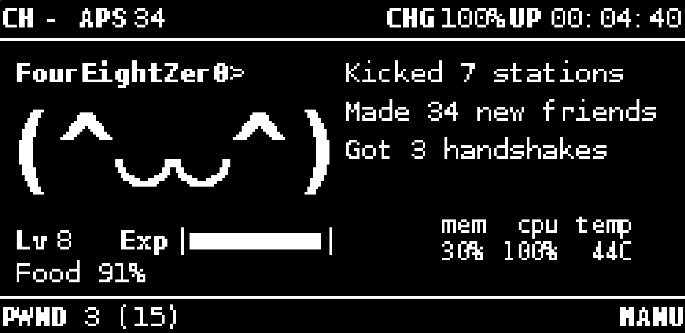

This plugin is designed to work with jayofelony Pwnagotchi 2.9.5.4

Copy expv3.py to /usr/local/share/pwnagotchi/custom-plugins/

Add the following to your /etc/pwngtochi/config.toml

```toml
[main.plugins.expv3]
enabled = true
lvl_x_coord = 5
lvl_y_coord = 81
exp_x_coord = 43
exp_y_coord = 81
bar_symbols_count = 10
```

Check out my other plugins
- Pwnagotchi-Nomagotchi-Food-Plugin
- Pwnagotchi-TrashTalk-Custom-Phrases-Plugin
- Pwnagotchi-EXPv3-Plugin
- Pwnagotchi-WebSSH-Plugin
https://github.com/FourEightZer0